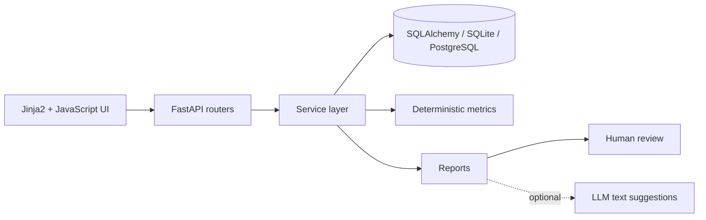

# Oficinas Manager

> A workshop operations platform for attendance, enrollment, monthly metrics and human-reviewed reporting.

Built from a real operational need: replacing fragmented forms, spreadsheets and repetitive monthly reporting with one structured workflow.

```text
LESSON RECORD
     ↓
STRUCTURED DATA
     ↓
ATTENDANCE + METRICS
     ↓
MONTHLY REPORT
     ↓
HUMAN REVIEW
```

## Why this project exists

Workshop operations often repeat the same information across attendance sheets, forms, spreadsheets and monthly reports.

That creates duplicated work, inconsistent numbers and weak traceability.

Oficinas Manager centralizes the workflow so information is recorded once and reused by deterministic business rules.

---

## Core capabilities

- student enrollment, dropout and reactivation;
- workshop and class management;
- lesson registration with complete attendance validation;
- monthly attendance metrics;
- individual frequency tracking;
- monthly report drafts with explicit human review;
- DOCX and printable report export;
- role-based access control for administrators and instructors;
- multi-tenant organization isolation;
- optional LLM-assisted text consolidation with deterministic fallback;
- SQLite for local use and PostgreSQL support for deployment;
- Alembic migrations, backup/restore tooling and automated tests.

---

## Architecture



The HTTP layer stays thin. Business rules live in `app/services/`, which keeps the domain logic reusable by the web interface, scripts and future agent tooling.

---

## Stack

| Layer | Technology |
| --- | --- |
| Backend | Python, FastAPI, Pydantic v2 |
| Persistence | SQLAlchemy 2, SQLite / PostgreSQL |
| Migrations | Alembic |
| Frontend | Jinja2, vanilla JavaScript, CSS |
| Authentication | Signed HttpOnly session cookie |
| AI | Optional Anthropic SDK integration |
| Testing | pytest |

---

## Notable engineering decisions

- **Complete attendance is enforced by the backend.** A lesson cannot be saved with missing student statuses.
- **Attendance metrics are deterministic.** AI is never used to calculate numbers.
- **Enrollment dates matter.** Lessons outside a student's valid enrollment interval do not affect frequency.
- **Tenant isolation is enforced in the service layer.** Cross-organization resources are treated as nonexistent.
- **Reports use a draft → review → final workflow.** Finalization is intentionally a human action.
- **AI is optional and bounded.** It only drafts text from existing records and falls back safely when unavailable.
- **Schema readiness is explicit.** The server refuses to run against a missing or outdated database schema.

---

## Local setup

```bash
python -m venv .venv
pip install -r requirements.txt
cp .env.example .env
alembic upgrade head
python scripts/seed.py --reset
uvicorn app.main:app --reload
```

On Windows, use the virtual environment executable under `.venv\Scripts\`.

Then open:

- application: `http://127.0.0.1:8000`
- API docs: `http://127.0.0.1:8000/docs`
- healthcheck: `http://127.0.0.1:8000/health`

---

## Demo data

`scripts/seed.py --reset` creates fictional workshops, instructors, students and attendance records for local testing.

Demo credentials are documented in the seed workflow and must never be used in production.

---

## Security

The repository does not require real credentials or production data.

Never commit:

- `.env` files;
- API keys;
- production databases;
- backups;
- real student or staff data.

The included `.gitignore` excludes local databases, backups, logs and environment secrets.

---

## Tests

```bash
pytest -q
```

The suite covers authentication, authorization, attendance rules, reporting, imports, tenant isolation, migrations, backup/restore and schema readiness.

---

## Project status

This repository represents the **portfolio-safe version** of a system developed from a real operational workflow.

Organization-specific migration utilities, internal documents and real operational data are intentionally excluded from this branch.